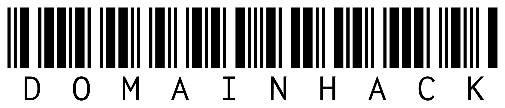

<div align="center">
  
</div>

<br />

A domain hack is a unique domain name that uses the TLD to create a word or sentence. For example, "bir.ds", "examp.le" or "hello.world". Domain hacks offer the ability to produce shorter domain names. This makes them potentially valuable as redirectors, pastebins, base domains from which to delegate subdomains and URL shortening services.


## Ingredients

- TypeScript
- Next.js
- Sass (SCSS Modules)
- lodash.debounce

## How to develop

```bash
$ git clone https://github.com/datejer/domainhack.git
$ cd domainhack
$ yarn
$ yarn dev
```

## How to lint

Using ESLint and Prettier.

```bash
$ yarn lint
```

## How to build

```bash
$ yarn build
```

## How to deploy

Deployed using ▲ Vercel at [domainhack.vercel.app](https://domainhack.vercel.app/)

[](https://vercel.com/new/clone?repository-url=https%3A%2F%2Fgithub.com%2Fdatejer%2Fdomainhack)

## Special thanks

- Thank you [domainhack.me](https://github.com/grigoreme/domainhack.me) for the inspiration and I hope to carry your legacy well.
